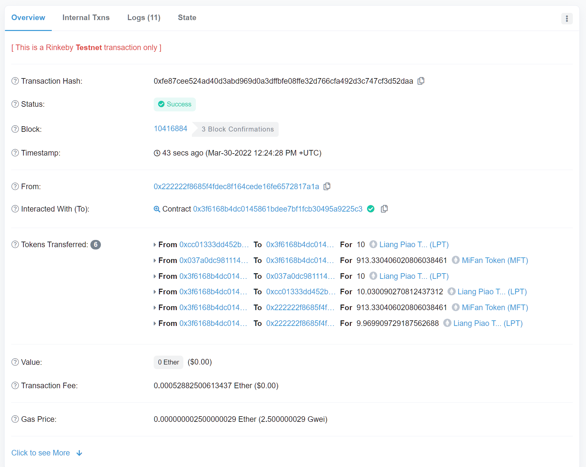

## W5_1 作业

- 以太坊测试网上部署两个自己的 ERC20 合约 MyToken，分别在 Uniswap V2、V3(网页上)添加流动性
- 作业：编写合约执行闪电贷（参考 V2 的 ExampleFlashSwap）：
  - uniswapV2Call 中，用收到的 TokenA 在 Uniswap V3 的 SwapRouter 兑换为 TokenB 还回到 uniswapV2 Pair 中。

### 做法如下

合约见 [w5-1_flashswap.sol](./w5-1_flashswap.sol)
Liang Piao Token: 0xb4c0c825538869f2657424f66c448d00bb7c2a48
MiFan Token: 0x7f988f48bf83aedce16804f8c2aa4d3cd501dfe8
V2Factory:0x5C69bEe701ef814a2B6a3EDD4B1652CB9cc5aA6f
V3router:0xE592427A0AEce92De3Edee1F18E0157C05861564
pair: 0xCc01333dD452B2b2ED2ad2866b36b01bB7e01a12

https://rinkeby.etherscan.io/tx/0xfe87cee524ad40d3abd969d0a3dffbfe08ffe32d766cfa492d3c747cf3d52daa

## W5_2 作业

- 在一笔交易中完成（模拟闪电贷交易）
  - 在 AAVE 中借款 token A
  - 使用 token A 在 Uniswap V2 中交易兑换 token B，然后在 Uniswap V3 token B 兑换为 token A
  - token A 还款给 AAVE
